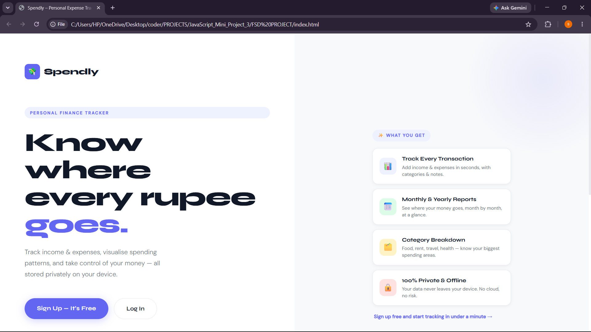
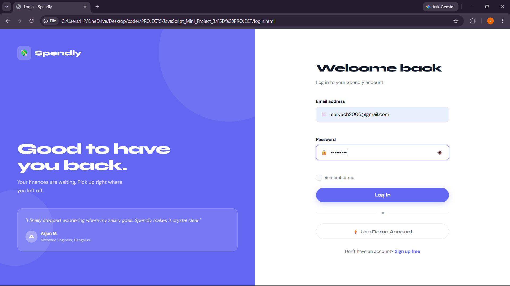
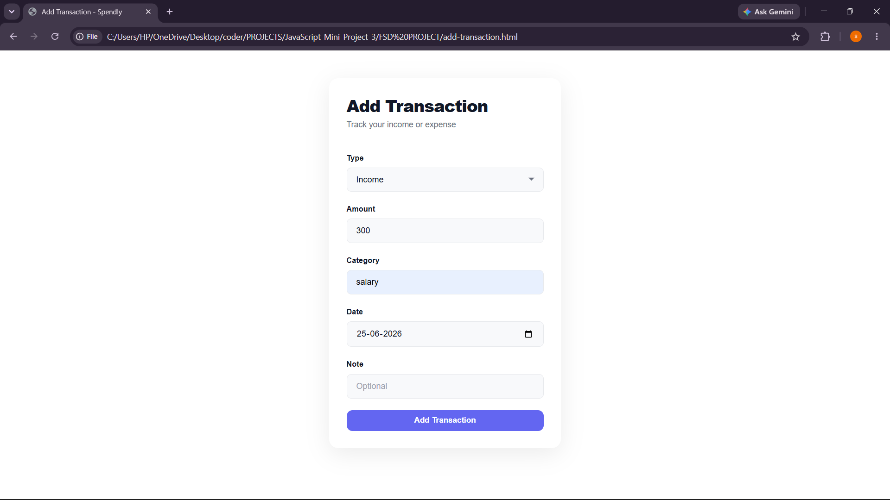
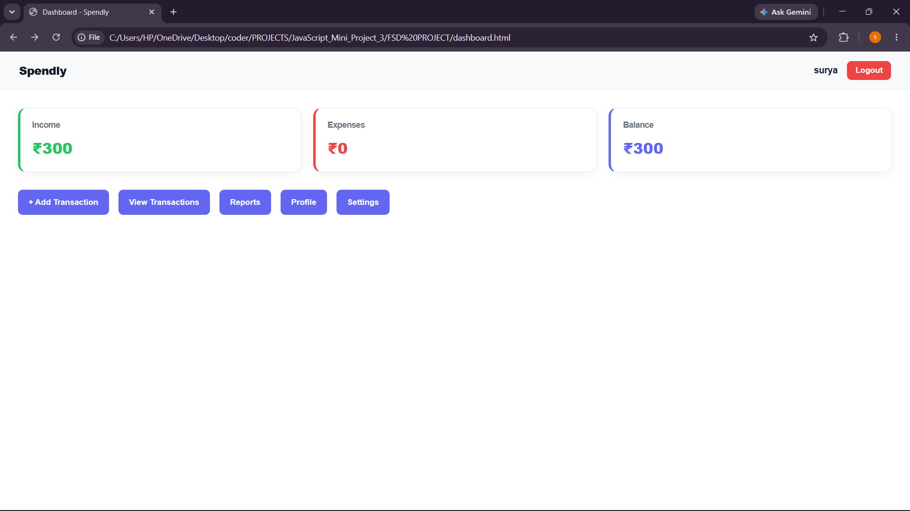

# Expense Tracker

## Description

An Expense Tracker web application built using HTML, CSS, and JavaScript. It helps users record income and expenses while automatically calculating the current balance.

## Features

* Add income and expenses
* Display transaction history
* Calculate total balance
* Simple and responsive interface

## Technologies Used

* HTML
* CSS
* JavaScript

## How to Run

1. Download or clone the project.
2. Open `index.html` in a web browser.
3. Add transactions to manage your expenses.

## Screenshot

