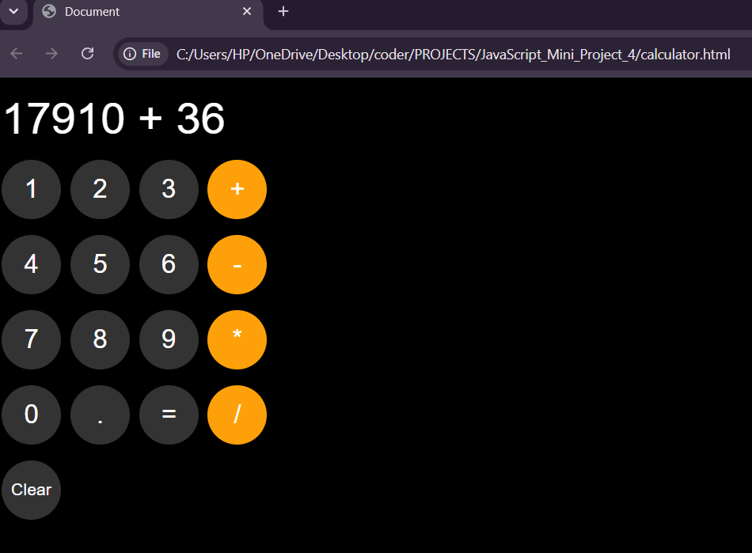
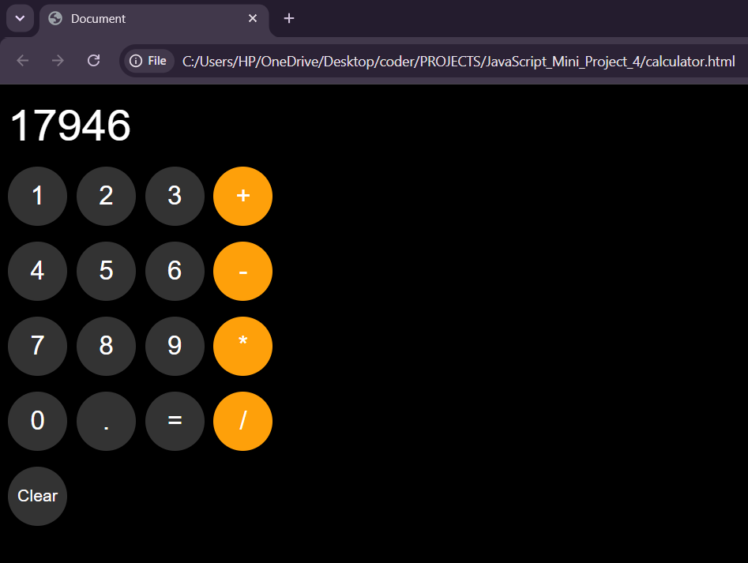

# Calculator

## Description

A basic calculator built using HTML, CSS, and JavaScript. It performs standard arithmetic operations through a clean and interactive user interface.

## Features

* Addition
* Subtraction
* Multiplication
* Division
* Clear button
* Responsive design

## Technologies Used

* HTML
* CSS
* JavaScript

## How to Run

1. Download or clone the project.
2. Open `calculator.html` in a web browser.
3. Perform calculations using the on-screen buttons.

## Future Improvements

* Scientific calculator mode
* Calculation history

## Screenshot

